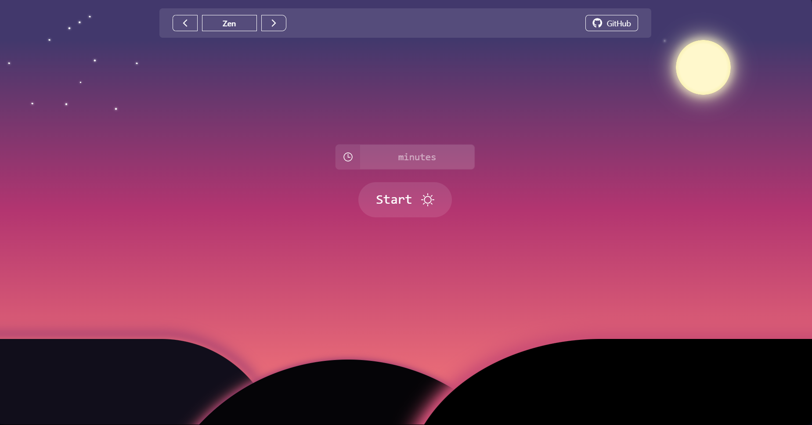
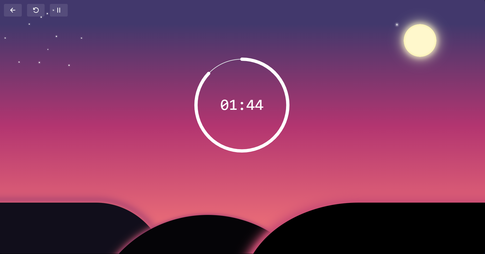

# ZEN 


  


ZEN is a timer application based on the Pomodoro technique, designed to help you work in a focused and conscious way. It combines simplicity, functionality and a clean design so you can manage your time efficiently, reduce distractions and take care of your mental health.

---

## 🚀 Start
Click on the following link to use the application: https://luis3fernando.github.io/Zen/
If you want to download it or adapt it to your environment, follow the steps to run it on your local computer:

```bash
git clone https://github.com/Luis3Fernando/Zen
```
```bash
cd Zen
```
```bash
npm install
```

```bash
npm run dev
```

---

## 📸 Screenshots 




